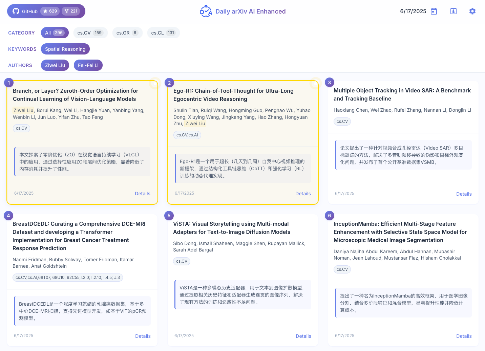
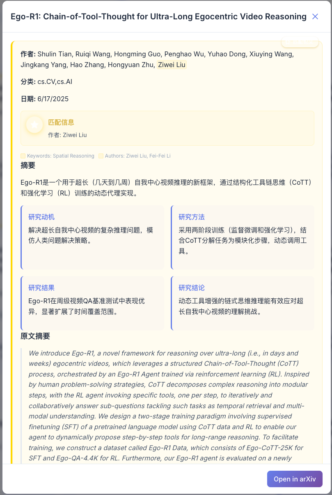
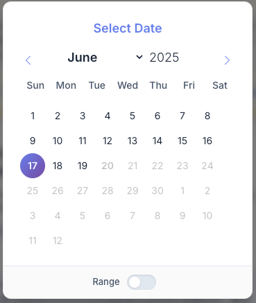
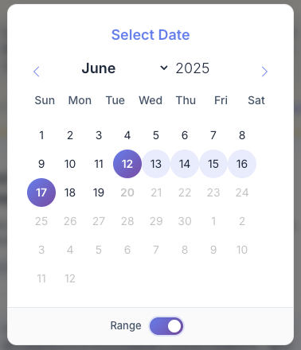
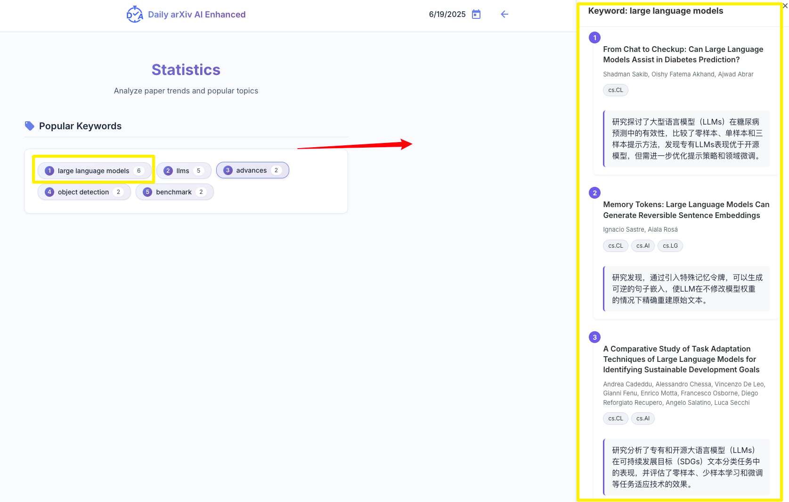
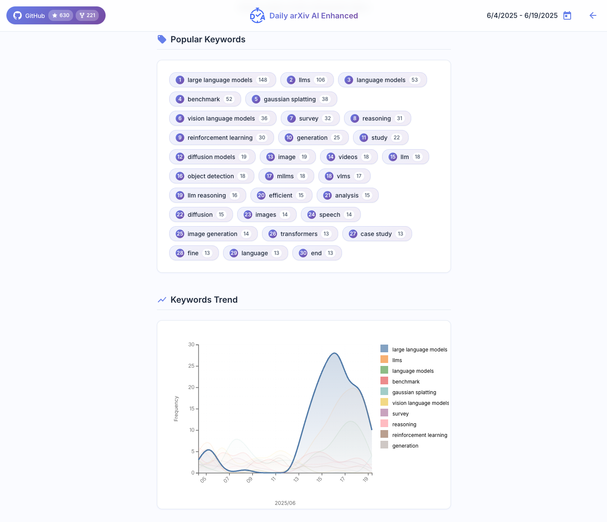

# About
This tool will daily crawl https://arxiv.org and use LLMs to summarize them.

Try in: https://dw-dengwei.github.io/daily-arXiv-ai-enhanced/

# Features
- Using the free features of GitHub Actions and GitHub Pages, **no server is required**
- Crawling data starts at dawn every day, and using DeepSeek to summarize. This period is during the off-peak discount period of DeepSeek, and it only costs about 0.2 CNY per day. 
- Provides a GitHub Pages front-end interface, uses LocalStorage to store **personalized preference** information (such as keywords and authors of interest), and highlights papers that matches the preferences.
- GitHub Pages takes into account the display effects of both the computer and mobile devices, ensuring that papers can be easily reviewed on mobile devices

# Screenshots
- Main page. Highlight the interested keywords and authors.

- Setting page. Set up keywords and authors and store them in your browser.

- Detail page. Show details of the paper you clicked.

- Date select. Enable selecting a single date or a date range for filtering papers (**Notice: a large date range will show lots of papers, which may lead your browser to get stuck.**).

- Statistics page (*in developing*). Help you analyze papers. Extract keywords for papers in the day(s) you select. In addition, if you select a range of dates, the keyword trends will be illustrated. (Fortunately, selecting a large range of papers **will not** stuck your browser to be stuck because this page will not show all papers. It may take a few seconds to process the keywords.)

# How to use
This repo will daily crawl arXiv papers about **cs.CV, cs.GR, cs.CL and cs.AI**, and use **DeepSeek** to summarize the papers in **Chinese**.
If you wish to crawl other arXiv categories, use other LLMs, or other languages, please follow the instructions.
Otherwise, you can directly use this repo in https://dw-dengwei.github.io/daily-arXiv-ai-enhanced/. Please star it if you like :)

**Instructions:**
1. Fork this repo to your own account
2. Go to: your-own-repo -> Settings -> Secrets and variables -> Actions
3. Go to Secrets. Secrets are encrypted and used for sensitive data
4. Create two repository secrets named `OPENAI_API_KEY` and `OPENAI_BASE_URL`, and input corresponding values.
5. Go to Variables. Variables are shown as plain text and are used for non-sensitive data
6. Create the following repository variables:
   1. `CATEGORIES`: separate the categories with ",", such as "cs.CL, cs.CV"
   2. `LANGUAGE`: such as "Chinese" or "English"
   3. `MODEL_NAME`: such as "deepseek-chat"
   4. `EMAIL`: your email for push to GitHub
   5. `NAME`: your name for push to GitHub
7. Go to your-own-repo -> Actions -> arXiv-daily-ai-enhanced
8. You can manually click **Run workflow** to test if it works well (it may take about one hour). By default, this action will automatically run every day. You can modify it in `.github/workflows/run.yml`
9. Set up GitHub pages: Go to your own repo -> Settings -> Pages. In `Build and deployment`, set `Source="Deploy from a branch"`, `Branch="main", "/(root)"`. Wait for a few minutes, go to https://\<username\>.github.io/daily-arXiv-ai-enhanced/. Please see this [issue](https://github.com/dw-dengwei/daily-arXiv-ai-enhanced/issues/14) for more precise instructions.

# To-do list
- [x] Feature: Replace markdown with GitHub pages front-end.
- [ ] Bugfix: In the statistics page, the number of papers for a keyword is not correct.
- [ ] Bugfix: In the date picker, the date and week do not correspond.
- [ ] Feature: Extract keywords with DeepSeek.
- [x] Update instructions for fork users about how to use GitHub Pages.

# Contributors
Thanks to the following special contributors for this project!!!
<table>
  <tbody>
    <tr>
      <td align="center" valign="top">
        <a href="https://github.com/JianGuanTHU"> <b>JianGuanTHU</b></a> 
      </td>
      <td align="center" valign="top">
        <a href="https://github.com/Chi-hong22"> <b>Chi-hong22</b></a> 
      </td>
    </tr>
  </tbody>
</table>

# Acknowledgement
We sincerely thank the following individuals and organizations for their promotion and support!!!
<table>
  <tbody>
    <tr>
      <td align="center" valign="top">
        <a href="https://x.com/GitHub_Daily/status/1930610556731318781"> <b>Github_Daily</b></a> 
      </td>
      <td align="center" valign="top">
        <a href="https://x.com/aigclink/status/1930897858963853746"> <b>AIGCLINK</b></a> 
      </td>
      <td align="center" valign="top">
        <a href="https://www.ruanyifeng.com/blog/2025/06/weekly-issue-353.html"> <b>阮一峰的网络日志   科技爱好者周刊（第 353 期）</b></a> 
      </td>
      <td align="center" valign="top">
        <a href="https://hellogithub.com/periodical/volume/111"> <b>《HelloGitHub》月刊   第 111 期</b></a> 
      </td>
    </tr>
  </tbody>
</table>

# Star history

